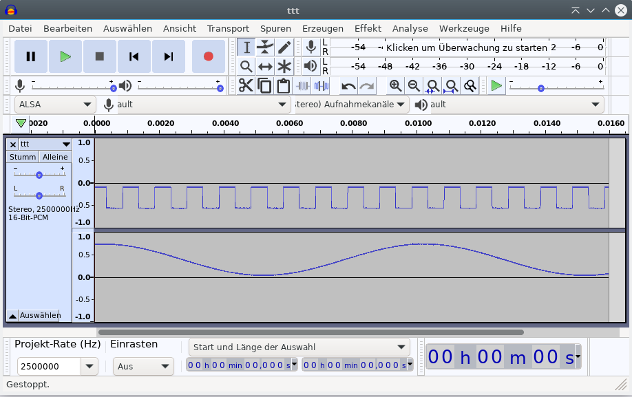
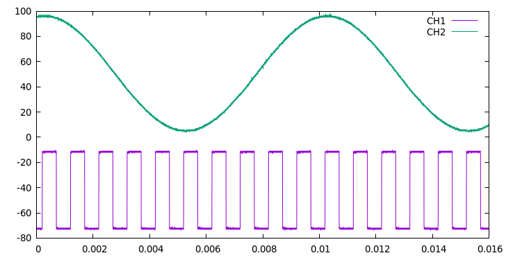

# Quick Data fetch from Hantek DSO 2000 series using a firmware patch

The Hantek DSO 2000 series provides a convenient SCPI interface; sadly using that to fetch data is [rather slow.](https://github.com/phmarek/hantek-dso2000), with 2 channels at 4MSamples taking (measured!) 300 seconds - mostly because of USB latency for each 4KB packet.

Here is a C file that compiles to a shared library which, if `LD_PRELOAD`ed to the binary (see below), provides a faster (and easier) way to fetch data -- just connect the script and press the `SAVE TO USB` button!

# Compatibility

Currently, this patch only works for the `2022-07-27` version of the firmware (the (currently) latest one).

The patch checks the binary for a few signature bytes (eg. the firmware string `"2.0.0(220517.00)"`), so it should be fairly safe - it should just not patch anything on the wrong version, and not break anything.

# Usage

With the patch active on your DSO, you'll see a short notice about that a few seconds after booting.

Pressing the `SAVE TO USB` button after booting will disable your USB console, so that the USB serial port can be used for data transfer. The scope will show the message `Activating quick fetch mode.` as confirmation.


Now you run the script:

```
receiver-src/hantek-dso-fetch.pl --cont --file /tmp/my-hantek-data.%d.csv
```

Now you're ready to go -- use your DSO as usual, and when you see a waveform you want to transfer to the PC just press the `SAVE TO USB` button. The scope locks updates (`RUN/STOP` will turn red), and the script will show a line about the transfer being started and then being done.

My machine with a DSO2D15 (no overclocking) needs approximately 15 seconds to transfer 2 channels with 4MSamples each - that's 20 times as fast as the SCPI way, being CPU bound on the scope (and ~30%) on my laptop.

If your script isn't running when you press the button, you'll see a notification about that; and, in case there are any communication problems (there shouldn't, though you could cause one eg. by stopping the script in the middle of a data transfer), an error message (eg. a transmission timeout) will be displayed.

## Parameters

- `--cont` makes the script wait for multiple data transfers; without that, it will only fetch one.
- `--file` (or just another argument) specifies where to save the CSV; a `%d` will be replaced by the (unix) timestamp, so that multiple transfers won't collide with each other.
- `--sep` defaults to a `Tab`; by using a comma (`,`) you could get a "real" CSV (which I wouldn't recommend - comma vs. decimal point is likely to go wrong in your spreadsheet or data analysis software.)
- `--device` allows you to switch to another USB serial device instead of `/dev/ttyACM0`.

## Output

The output is a CSV (really TSV ;) file with two comment lines; here's an example:
```
# CH1: scale 0.500000, offset 50
# CH2: scale 0.500000, offset -51
index   time    raw.CH1 raw.CH2 volt.CH1 volt.CH2
0       0       52      -50     0.04     0.02
1       2e-07   52      -50     0.04     0.02
2       4e-07   52      -50     0.04     0.02
```

The header lines are optimized for `R`.

You can also get a `WAV` file, by simply specifying the file extension `.wav`:




### Sample graphing

Here's an 2 x 40 KSamples example using [`gnuplot`](http://www.gnuplot.info/):
```
F=/tmp/test-1664046008.csv # specify your file here 
gnuplot -p -e " plot '$F' using 2:3 with lines title 'CH1', '$F' using 2:4 with lines title 'CH2'"
```


## Error situations

Both the DSO patch and the fetch script use timeouts - when you see errors or are in doubt, wait two minutes (timeout is 60 seconds) and restart the local script. It will slurp up all data still in the USB pipeline, while the DSO patch will have stopped sending as soon as no receiver was available any more.

## But I need by USB console again!

No problem. Just don't press the `SAVE TO USB` button after booting the DSO (then the console will _still_ be active), or if you already used the quick fetch functionality, just stop the script and press the button 3 times in 4 seconds -- that will show a message and reactivate the USB console.

Pressing the button once more will switch to the quick fetch functionality and so will stop your USB console again.

# *Manual* Installation

*BE CAREFUL -- YOU NEED TO KNOW WHAT YOU'RE DOING! YOU CAN BRICK YOUR DSO IF YOU DO SOMETHING STUPID!*

Better just not do that but wait for one of David's great update packages.

## Compilation of the library

You need a cross-compiler for ARM (see below); switch to the `patch-src/` directory and run `make`.

## Transfer of the library to the DSO

You need [a USB console](https://drive.google.com/drive/folders/1B5mgsuO5OvIwT3gi_5n9HC6r_BxRoCuF) (Thanks, David!!); then, by (temporarily) disabling the serial console via `killall -STOP getty`, run

```
cd /root
rz --verbose --overwrite --binary < /dev/ttyGS0 > /dev/ttyGS0
```
on the DSO and `make sz` in the `patch-src/` directory to transfer the file.


## Activation of the patch

Use `vi /dso/app/app` and insert the `export...` line near the end of the file; see here for the patched version:

```
cd $APP_DIR
export LD_PRELOAD=/lib/libdl.so.2:/dso/lib/libanolis.so.0:/root/quick-fetch.so
./$APP_REL_NAME&
```

Reboot the scope, and you're done!

## For reference: Debian compile infrastructure


Use this in your `/etc/apt/sources.list.d/arm-hantek-env.list`:
```
deb [ arch=armel check-valid-until=no  ] https://snapshot.debian.org/archive/debian/20211213T205517Z/ testing main
deb [ arch=armel check-valid-until=no  ] https://snapshot.debian.org/archive/debian/20211213T205517Z/ unstable main
```

and install `gcc-9-cross-base=9.5.0-1cross1`, `libc6-armel-cross=2.33-1cross1`,  `libc6-dev-armel-cross=2.33-1cross1`.


## More information

A previous version used the USB storage interface for transferring data; but that precluded using the USB console, and had a longer latency because the data needed full preparation on the DSO before being transferred to the PC.

The current solution just does the DSO and local CSV printing in parallel and is therefore faster.
